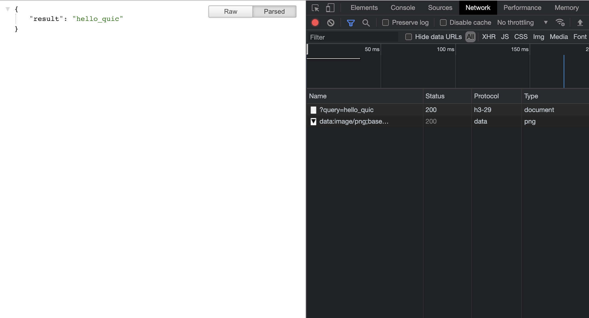

# quic-nginx-flask-small-sample



## Getting Start

1. Get cert file with letsencrypt

```sh
$ docker run -it --rm --name certbot \
    -v "${PWD}/temp/letsencrypt:/etc/letsencrypt" \
    certbot/certbot certonly --manual --preferred-challenges=dns\
        --agree-tos \
        --email your@email \
        --no-eff-email \
        -d YOUR_DOMAIN_NAME
```

2. Replace nginx placeholder

```sh
$ sed -i -e "s/YOUR_DOMAIN_NAME/YOUR_DOMAIN_NAME/g" nginx.conf
```

3. Run

```sh
docker-compose up
```

## Author

chigichan24

## LICENSE

MIT
